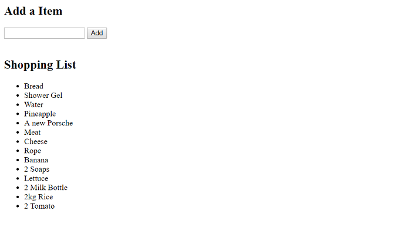

# MARKET LIST

> A tool to list shopping needs



For this project, my task was to create a **Shopping List Webapp**. This tool is a Python program using the `Jinja2` framework and `webapp2` module.  This tool receives user input and delivers a list of received items.

## Requirements

- Python 2.7
- webapp2
- webob
- Google Cloud SDK

## Development setup

1. Donwload and Install Python 2.7 [link](https://www.python.org/downloads/release/python-2716/)

2. Setting Up a Google Cloud SDK Environment [link](https://cloud.google.com/python/setup?hl=en-us)

2. Install all needed Python modules

```sh
pip install webapp2
```

```sh
pip install webob
```

## Running the program

1. in the same folder that **main.py** file are: `python "C:\Users\YOUR_USER\AppData\Local\Google\Cloud SDK\google-cloud-sdk\bin\dev_appserver.py" .`

  * _If you set the GSDK on PATH just type `python dev_appserver .` and ignore #2 instruction_


2. Replace your PC user in `YOUR_USER`. (_Dont forgot the dot in the final._)

3. In your browser access [http://localhost:8080/](http://localhost:8080/)

## Usage example

In the root page `http://localhost:8080/` you can add new items to your shopping list

_If you find bugs or problems you can sent a message to me [twitter] or [email]._


## Release History

* 0.0.2
   * README file updated
* 0.0.1
   * First version

## Meta

Pedro Carvalho – [@PedrArch](https://twitter.com/PedroArch) – pedrofrancocarvalho@gmail.com

[https://github.com/PedroArch](https://github.com/PedroArch/)

## Contributing

1. Fork it (<https://github.com/PedroArch/market-list/fork>)
2. Create your feature branch (`git checkout -b feature/fooBar`)
3. Commit your changes (`git commit -am 'Add some fooBar'`)
4. Push to the branch (`git push origin feature/fooBar`)
5. Create a new Pull Request

<!-- Markdown link & img dfn's -->
[twitter]:https://twitter.com/PedroArch
[github]:https://github.com/PedroArch
[email]: pedrofrancocarvalho@gmail.com
